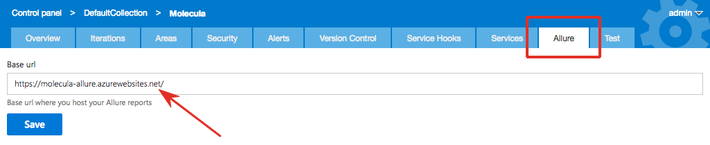
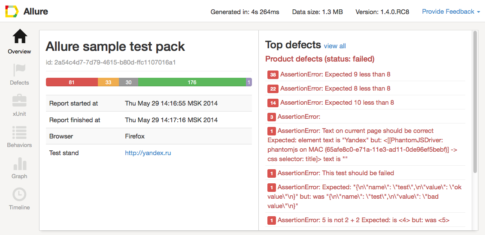
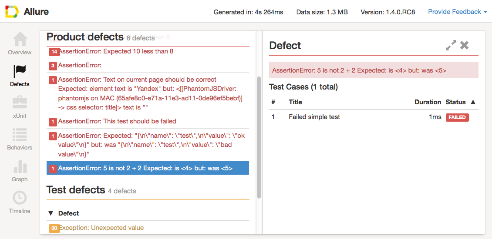
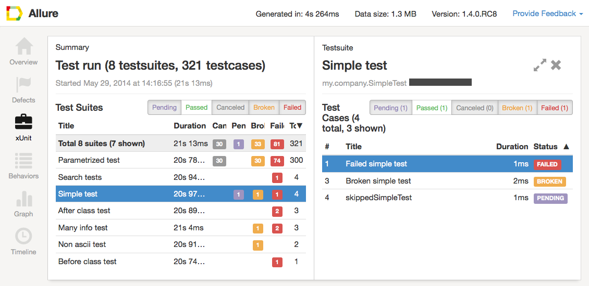
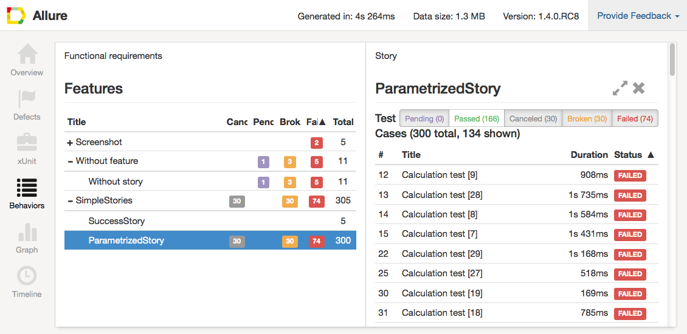
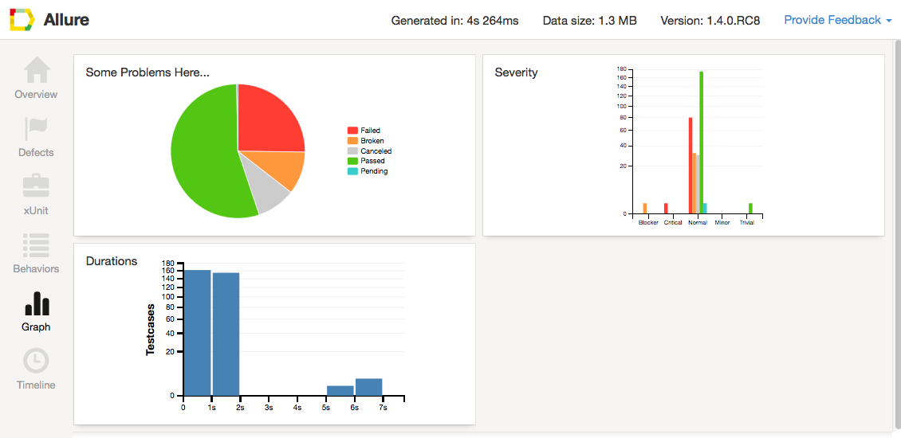
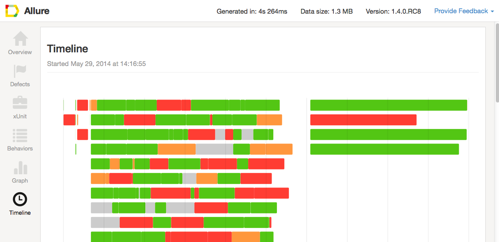

This extension allows you to generate and view Allure test reports right from the Visual Studio Team Services interface.

**Please note** that due too some limitation in the current version of Team Services API the Allure Generate Build Step will only generate the Allure report and save it as a build artifact. To enable "Open Allure Report" option you will need to add additional build step to publish the report somewhere. For instance you can create a simple Azure Web App and upload reports there using Build Task extension like [FTP Upload](https://marketplace.visualstudio.com/items?itemName=januskamphansen.ftpupload-task). You website should support HTTPS.

When you have your website up and running we will use "https://[BaseUrl]/$(Build.BuildNumber)" to open a report for the corresponding build. You will need to set BaseUrl property on the Allure settings page in the Project settings:

## Why to use Allure

There are lots of cool testing frameworks for different programming languages. Unfortunately only few of them can provide good representation of test execution output. Allure is an open-source framework designed to create test execution reports clear to everyone in the team.

## How it works

Allure is based on standart xUnit results output but adds some supplementary data. Any report is generated in two steps. During **test execution** (first step) a small library called **adapter** attached to testing framework saves information about executed tests to XML files. We already provide adapters for popular Java, PHP, Ruby, Python, Scala and C# test frameworks.

During **report generation** (second step) XML files are transformed to HTML report. This can be done with command line tool, plugin for CI or build tool. See [examples](https://github.com/allure-examples) and [documentation](https://github.com/allure-framework/allure-core/wiki) for more details.

## How it looks like

**Overview** page shows overall test execution statistics with a list of test parameters. Right section contains top defects grouped by defect message.

**Defects** page gives detailed list of defects revealed during test execution. We distinguish product defects which correspond to failed tests and test defects - correspond to broken tests.

**xUnit** page shows statistics in terms of [xUnit](http://en.wikipedia.org/wiki/XUnit). You can view test statistics for each test suite and detailed information about every test case.

**Behaviors** page groups test data in terms of [BDD](http://en.wikipedia.org/wiki/Behavior-driven_development). You can easily view which features and stories have problems.

**Graphs** help you to visually estimate test results.

**Timeline** page shows in which moment of time every test case was executed and how long it was running.

